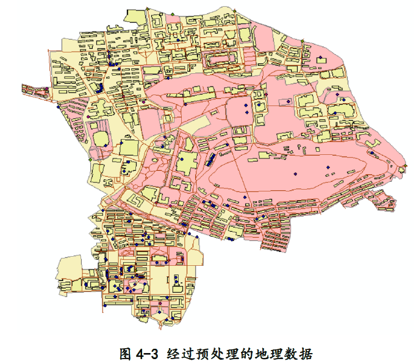

# 论文文件拷贝
[论文copy已存在repo中](https://github.com/affogato-lab/thesis-bug-pasta/blob/main/_media/%E5%A5%B3%E6%80%A7%E8%A7%86%E8%A7%92%E4%B8%8B%E8%80%83%E8%99%91%E6%81%90%E6%83%A7%E6%84%9F%E7%9A%84%E6%AD%A5%E8%A1%8C%E8%B7%AF%E5%BE%84%E8%A7%84%E5%88%92%E7%A0%94%E7%A9%B6_%E8%B0%A2%E6%97%B6%E6%99%94.pdf)

# 总论
- 地图缺失图例、标题、比例尺等地图基本要素，地图注释不明
- 2.4.1和2.4.2过于废话

# 图4-3 地图要素缺失
<figure align="center">
    
    <figcaption/>原图出自论文正文第35页，pdf版的第44页
</figure>

1. 缺失比例尺、标题、比例尺等地图关键信息
2. 地图注释不明，读者只能从上下文判断是武大校园的地图

# 2.4.1和2.4.2的问题
首先，先把这两章贴出来：
> **2.4.1 文献研究法**
> 
> 文献研究法是指通过对相关领域的文献进行系统性的搜集、整理、分析和综合，以获取相关领域的知识和信息，为研究问题的提出和解决提供理论和实证支持的研究方法，包括文献综述法、文献分析法、文献检索法、文献比较法、文献评价法。文献研究法是科学研究的基础是研究者获取研究素材、了解研究现状、发现研究问题、构建研究框架和验证研究结论的重要手段。通过文献研究法，研究者可以深入了解研究领域的发展历程、研究热点和前沿问题，提高研究效率和水平。
> 
>文献研究的目的和意义在于，了解研究领域的发展历程和现状，避免重复研究，提高研究效率；为研究问题的提出和解决提供依据，有助于建立研究框架和构建理论模型。在文献研究阶段，研究者应该收集与所研究问题相关的理论和理论依据、建立研究框架、提出假设、提出解决问题的方法或思路。
>
> **2.4.2 问卷调查法**
> 
> 问卷调查法是一种收集数据和信息的研究方法，通过设计和分发问卷来获取被调查者的意见、看法、态度和行为等信息。问卷调查法通常包括以下几个步骤：设计问卷、选取样本、分发问卷、收集数据、分析数据、撰写报告。
> 
>问卷调查法在社会科学研究、市场调研和社会调查等领域具有重要的意义。首先，问卷调查法可以帮助研究者和调查机构获取客观数据和信息，了解被调查者的观点、看法、态度和行为，为研究和调查提供数据基础。其次，通过问卷调查可以深入了解受调查者的需求、期望、偏好和行为，揭示其心理和行为特征，为个体和群体的特点提供详细描述和分析。再者，问卷调查可以帮助研究者揭示社会现象和问题的普遍性和特点，发现规律性和趋势性的变化，为社会问题的解决提供依据。最后，问卷调查可以用来评估政策、项目或活动的效果和影响，了解受调查者对其的评价和意见，为政策的改进和调整提供依据。
>
>问卷调查法可以帮助研究者和决策者了解受调查者的意见和需求，揭示社会现象和问题的规律性和趋势性，为决策和行动提供科学依据，具有重要的研究和应用价值。

完全是堆砌字数。至少要提到调阅的文献数量、文献来源、文献归纳总结、对实验设计/结果的帮助、调查问卷的设计（原文后文有提）、受访者的大致画像等等。

