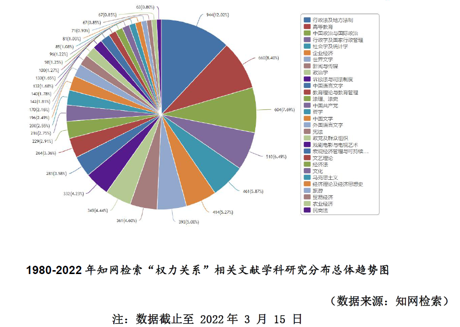

# 论文下载
[下载地址点击这里](https://github.com/affogato-lab/thesis-bug-pasta/blob/main/_media/%E9%80%89%E7%A7%80%E7%B1%BB%E9%9F%B3%E4%B9%90%E8%8A%82%E7%9B%AE%E4%B8%AD%E7%B2%89%E4%B8%9D%E7%9A%84%E6%9D%83%E5%8A%9B%E5%85%B3%E7%B3%BB%E7%A0%94%E7%A9%B6_%E5%BC%A0%E4%BD%B3%E8%8E%89.pdf)

# 总论
- 帝高阳之苗裔兮，朕皇考曰伯庸。
- 摄提贞于孟陬兮，惟庚寅吾以降。
- 皇览揆余初度兮，肇锡余以嘉名。

# 引用错误
> 然而在哈马斯看来：“大众传媒塑造出来的世界所具有的仅仅是公共领域的假象”随着资本开始出现垄断

作者名错误。引用句子源自哈贝马斯的《公共领域的结构转型》[1]

# 图片用法错误

<figure align="center">
    
    <figcaption>原图出自论文正文第11页，pdf版第18页</figcaption>
</figure>

1. 饼图无法看出趋势，只能看出各部分占比
2. 论文上下文未对该图进行说明，图片也没有编号和注释。

# 参考文献
1. 尤尔根·哈贝马斯. 公共领域的结构转型. 翻译 曹卫东等, 学林出版社, 原作名：Strukturwandel der Öffentlichkeit, 1999. Douban, https://book.douban.com/subject/1009891/.
